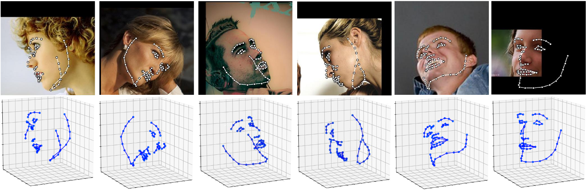

1. 输入图片尺寸224*224(人脸检测出来的图片尺寸是112*112)  
2. 亚洲人脸带偏航角的数据集制作(调用现有的人脸角度检测算法)  
2.1 FSA-Net人脸角度检测算法  
2.2 FSA-Net使用IJBA数据集做验证 precision=0.02178准确率极低,舍弃  
2.3 deep-head-pose人脸角度检测算法(舍弃) 
2.4 3D landMark计算人脸偏航角  
      
2.5 
