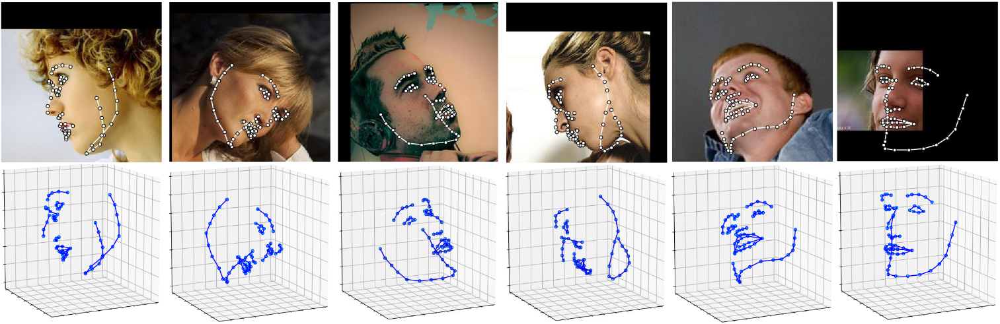

1. 输入图片尺寸224*224(人脸检测出来的图片尺寸是112*112)  
2. 亚洲人脸带偏航角的数据集制作(调用现有的人脸角度检测算法)  
2.1 FSA-Net人脸角度检测算法  
2.2 FSA-Net使用IJBA数据集做验证 precision=0.02178准确率极低,舍弃  
2.3 deep-head-pose人脸角度检测算法(舍弃) 
2.4 3D landMark计算人脸偏航角  
      
2.5 
3. 人脸识别数据集处理流程  
原始数据集切割成训练集验证集  
对原始数据集ID做重命名

4. 更改源  
4.1 阿里云 http://mirrors.aliyun.com/pypi/simple/  
  中国科技大学 https://pypi.mirrors.ustc.edu.cn/simple/   
  豆瓣(douban) http://pypi.douban.com/simple/    
  清华大学 https://pypi.tuna.tsinghua.edu.cn/simple/   

5. 人脸偏航角算法更新算法(用偏航角和俯仰角共同来表征侧脸)  
5.1 具体如何表征需要在长方体中示意  
     
5.2 原始分类算法在验证集上效果好,但是在监控视频下效果并不好(甚至很差)  
5.3 传统的侧脸识别一般只有偏航角没有俯仰角因此问题比较简单,考虑到俯仰角其根本原因是在监控视频下俯仰角一定是存在的     

6. 人脸偏航角存在跳变(跳变是因为面部稍微低头或者旋转就会出现)的问题,如何解决  
6.1 平滑处理滤波,取多少帧数合适